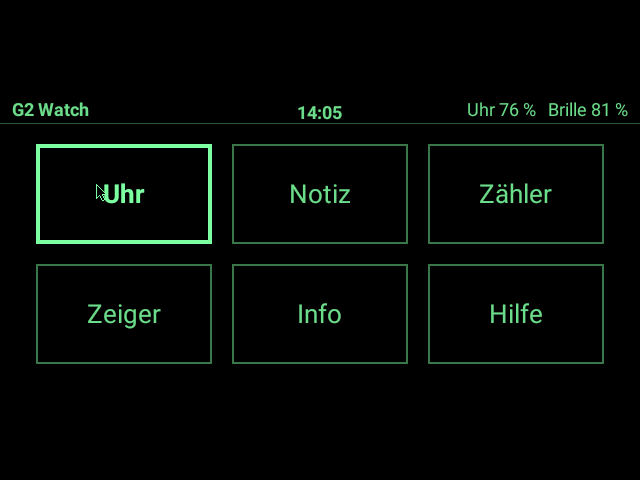
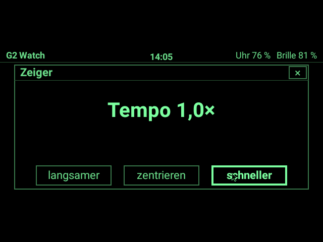
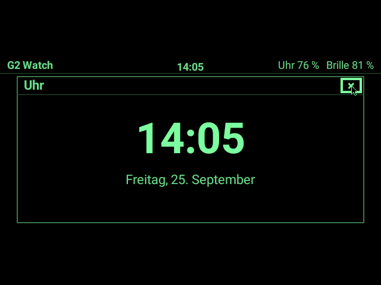
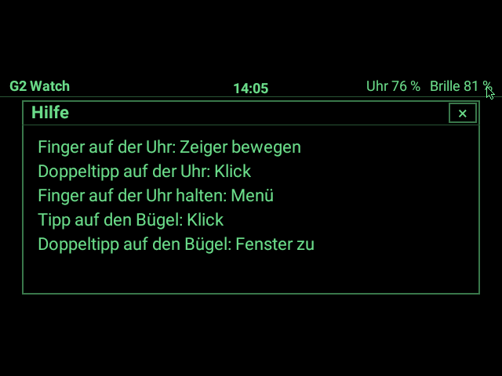
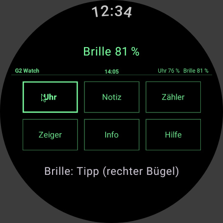
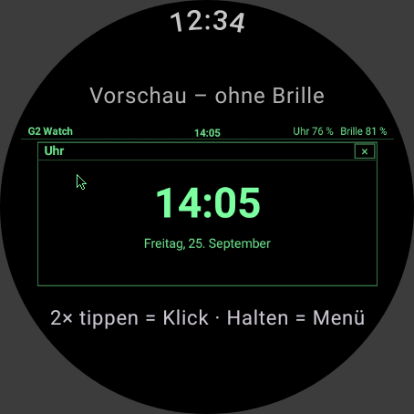
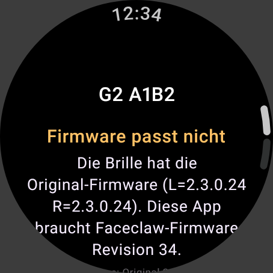
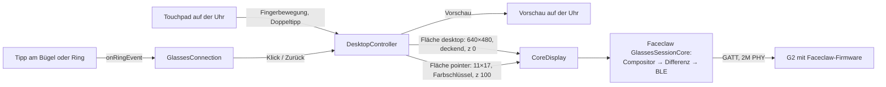
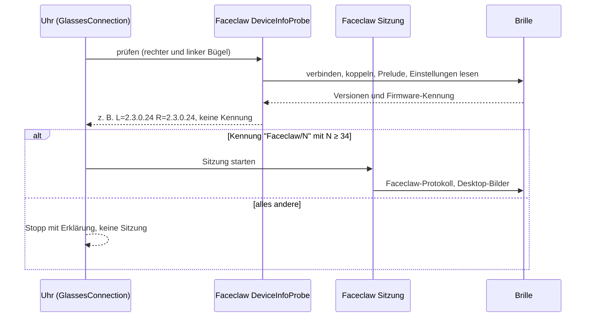

# G2 Watch – Architektur

**G2 Watch** ist eine Wear-OS-App für die Pixel Watch, die die Even Realities G2 direkt ansteuert. Die Uhr ist der Rechner, die Brille der Bildschirm: Auf der Brille liegt ein kleiner Desktop mit Mauszeiger, das Uhrdisplay ist das Touchpad.

Die App baut auf [Faceclaw](https://github.com/jimrandomh/faceclaw) auf (Jim Babcock, GPL-3.0). Faceclaws Kotlin-Kern mit Bluetooth-Protokoll, Sitzung und Compositor ist unverändert übernommen. Neu geschrieben sind nur der Wear-OS-Teil und der Desktop.

| Start | Fenster „Zeiger“ |
|---|---|
|  |  |
| **Fenster „Uhr“** | **Fenster „Hilfe“** |
|  |  |

Die Bilder zeigen das 640×480-Bild, das die App an die Brille schicken würde, in den 16 Grüntönen des Displays. Erzeugt hat sie der eigene Renderer der App mit Androids Schrift, nicht die Brille (siehe [Bilder neu erzeugen](#bilder-neu-erzeugen)).

Auf der Uhr, gerendert für ein rundes Display mit 454 Pixeln (grau: außerhalb des Zifferblatts):

| Touchpad, verbunden | Vorschau ohne Brille | Firmware passt nicht |
|---|---|---|
|  |  |  |

## Stand (25.09.2026)

| Situation | Was die App tut | Geprüft |
|---|---|---|
| Ohne Brille | Touchpad und Desktop laufen, die Uhr zeigt eine Vorschau des Brillenbilds | Unit-Tests, Bilder oben |
| Brille mit Original-Firmware | verbindet, liest die Firmware-Version, hört auf und erklärt warum | Unit-Tests mit Attrappen |
| Brille mit Faceclaw-Firmware ab Revision 34 | zeigt den Desktop auf der Brille, Zeiger folgt dem Finger auf der Uhr | **nicht auf Hardware getestet** |

**Voraussetzung für die Anzeige auf der Brille** ist Faceclaws eigene Firmware in Revision 34. Das letzte Faceclaw-Release 0.7.2 (19.09.2026) arbeitet mit Revision 22. Revision 34 erzeugt der aktuelle g2flash-Quellstand (`main`, `814db36`). Ob und wann eine eigene Firmware auf die Brille kommt, entscheidest du. Risiken und Wege zurück stehen in [RECHERCHE_FIRMWARE.md](../RECHERCHE_FIRMWARE.md) (Stufe 4 des Stufenplans). Die App selbst enthält keinen Weg dorthin.

## Module

| Modul | Herkunft | Inhalt |
|---|---|---|
| `faceclaw-core` | Faceclaw `a6291cf`, unverändert | Kotlin-Multiplatform-Kern: G2-Protokoll, Sitzung (Verbindung, Authentifizierung, Heartbeat, Wiederverbinden, Leases), Compositor, Bildübertragung. 120 Dateien, rund 20 000 Zeilen, 180 eigene Tests. Siehe [UPSTREAM.md](../faceclaw-core/UPSTREAM.md). |
| `faceclaw-android` | Faceclaw `a6291cf`, unverändert | Androids GATT-Anbindung: `FaceclawBleManager`, `AndroidSessionLink`, `AndroidStockLink`, `FaceclawDeviceInfoProbe`. Siehe [UPSTREAM.md](../faceclaw-android/UPSTREAM.md). |
| `app` | eigen | Die Wear-OS-App, rund 3000 Zeilen Kotlin und 1100 Zeilen Tests |

Nicht übernommen ist Faceclaws Oberfläche: rund 88 000 Zeilen TypeScript für NativeScript auf dem Telefon, mit Shell, Apps, Terminal, Assistent und Flash-Assistent. Sie läuft nicht auf Wear OS. An ihre Stelle tritt eine kleine Desktop-Schicht in Kotlin. Der schwierige, wertvolle Teil, nämlich wie man mit der Brille spricht und Bilder effizient überträgt, steckt im Kotlin-Kern und läuft unverändert auf der Uhr.

### Pakete der App

| Paket | Klassen | Aufgabe |
|---|---|---|
| `glasses` | `GlassesConnection`, `FirmwareRequirement`, `GlassesParts`/`FaceclawParts`, `WearSessionHost`, `CoreDisplay`, `GlassesService`, `GlassesState` | Verbindung zur Brille: erst prüfen, dann Sitzung. Übersetzt Faceclaws Ereignisse (Status, Akku, Tipps am Bügel) für App und Desktop. |
| `desktop` | `Desktop`, `DesktopRenderer`, `DesktopController`, `Pointer`, `GrayRaster`, `AndroidTextPainter`, `GlassesDisplay` | Der Desktop: Layout, Kacheln, Fenster, Knöpfe, Zeiger. Zeichnet in ein 8-Bit-Graubild und reicht es an Faceclaws Compositor weiter. |
| `ui` | `TouchpadScreen`, `Screens`, `BatteryRow` | Die Uhr-Oberfläche mit Wear Compose Material 3 |
| `ble` | `G2Scanner`, `G2Devices` | Suche nach den Bügeln, aus G2 Direct übernommen |
| Wurzel | `G2WatchApp`, `MainActivity`, `Scheduler` | Hält Desktop und Verbindung für den ganzen Prozess, Navigation |

## Datenfluss



- **Desktop:** eine deckende Fläche über den ganzen Bildschirm. Sie wird nur neu gezeichnet, wenn sich etwas ändert: Hover, Klick, Uhrzeit, Akkustand. Ihr Fingerabdruck ist ein Hash über die Pixel, damit Faceclaw Gleiches als „nichts zu tun“ erkennt.
- **Zeiger:** eine kleine Fläche mit Farbschlüssel darüber (Wert 0 durchsichtig, 1 schwarz). Bewegt sich der Zeiger, ändert sich nur die Position dieser Fläche, höchstens 30-mal pro Sekunde. Faceclaw vergleicht das neue Gesamtbild mit dem angezeigten und schickt nur den geänderten Bereich.
- **Sichtbarer Streifen:** Wie in Faceclaws Standardlayout liegt alles in einem 288 Pixel hohen Streifen in der Mitte (y = 96 bis 383), weil die Optik nicht die ganze Panelhöhe zeigt.
- **Bewegung:** Die Uhr rechnet Fingerbewegung in Brillenpixel um, mit sanfter Beschleunigung, abgestimmt auf der Pixel Watch in G2 Direct. Langsame Striche sind präzise, schnelle Wischer überqueren den Bildschirm.

## Sicherheit: erst prüfen, dann verbinden



1. **Prüfen:** Faceclaws Device-Info-Probe verbindet sich wie die Even-App. Sie authentifiziert sich (bei der ersten Verbindung erscheint dabei die Kopplungsanfrage der Uhr), sendet den Sitzungsauftakt und liest die Einstellungen aus. Dabei wird nichts verändert und nichts angezeigt.
2. **Entscheiden:** `FirmwareRequirement` ist eine Portierung von Faceclaws `app/g2/firmware-compat.ts`. Nur die Kennung „Faceclaw/N“ mit N ≥ 34 führt zur Sitzung. Bei Original-Firmware, älterer Faceclaw-Firmware, fremder Custom-Firmware und ausbleibender Antwort bleibt die App stehen und erklärt warum. Anders als Faceclaws App verlangt die Uhr einen positiven Nachweis: Ohne Angabe gibt es keine Sitzung.
3. **Sitzung:** Erst jetzt startet Faceclaws Sitzung. Erst sie spricht das private Protokoll der Custom-Firmware. Weil sie nur nach bestandener Prüfung startet, erreicht keine ihrer Nachrichten eine Brille mit anderer Firmware. Meldet die Sitzung später eine unpassende Firmware, beendet die App sie, wie Faceclaw auch.
4. **Beenden:** Beim Trennen schickt Faceclaws Sitzung ihre Aufräumnachricht. Die Firmware kehrt dann zur normalen Anzeige zurück.

Die App schreibt nie Firmware. Faceclaws Kern enthält zwar die Flash-Abläufe (`OtaFlashFlow`, `FlashPromptFlow`), weil er unverändert übernommen ist, doch die App ruft sie nirgends auf. `NoFlashingTest` schlägt fehl, sobald App-Code sie verwendet.

Eine Designentscheidung, die sich leicht ändern lässt: Neuere Revisionen als 34 werden akzeptiert, wie in Faceclaws App, weil Revisionen den Vertrag laut Faceclaw nur erweitern. g2flash rät Fremdprojekten, nur exakt bekannte Kennungen zu akzeptieren. Soll die Uhr so streng sein, reicht in `FirmwareRequirement.check` ein `==` statt `>=`.

## Bedienung

| Wo | Geste | Wirkung |
|---|---|---|
| Uhr | Finger bewegen | Zeiger bewegen (relativ, springt nie) |
| Uhr | Doppeltipp | Klick am Zeiger |
| Uhr | Finger 0,9 s halten | Menü |
| Uhr | Krone drehen | Zeigertempo (0,3× bis 4×) |
| Bügel oder Ring | Tipp | Klick am Zeiger |
| Bügel oder Ring | Doppeltipp | Fenster schließen |

Auf dem Desktop liegen sechs Kacheln: **Uhr** (große Uhrzeit), **Notiz** (Platzhalter für Diktat), **Zähler** (−, 0, +), **Zeiger** (Tempo und Zentrieren), **Info** (Verbindung, Firmware, Akkus) und **Hilfe**. Ein offenes Fenster ist modal und schließt sich über das × oben rechts oder per Doppeltipp am Bügel.

## Laufzeit auf der Uhr

- `G2WatchApp` hält Desktop und Verbindung für den ganzen Prozess. Die Verbindung überlebt deshalb, wenn die Activity neu entsteht.
- `GlassesService` ist ein Vordergrunddienst vom Typ `connectedDevice`. Er läuft, solange geprüft oder verbunden wird, und zeigt eine laufende Mitteilung. Beendet wird er erst, wenn er im Vordergrund angekommen ist. Ein früheres Stoppen quittiert Android mit dem Beenden der ganzen App, was bei schnellem Verbinden und Abbrechen passieren könnte.
- Solange die Brille den Desktop zeigt, hält `WearSessionHost` einen Partial Wake Lock, wie Faceclaw auf dem Telefon. Er wird freigegeben, wenn die Brille lädt, wenn die Verbindung abreißt und neu aufgebaut wird und wenn getrennt wird. Das Neuverbinden kann Stunden dauern, wenn die Brille außer Reichweite ist, und die Uhr wacht dafür oft genug von selbst auf.
- Während der Prüfung und solange die Brille verbunden ist, bleibt das Uhrdisplay an, weil das Touchpad im Ambient-Modus nicht funktioniert. Lädt die Brille, ist sie außer Reichweite oder ist gar keine verbunden, geht es wie gewohnt aus.
- Threads: Der Desktop hat einen eigenen Thread und Faceclaws Sitzung einen Worker. Alles, was auf Bluetooth warten kann, läuft nacheinander auf einem Verbindungs-Thread. Dazu gehört auch das Schließen der Firmware-Prüfung: Faceclaws `FaceclawBleManager` hält bei jedem GATT-Schritt bis zu 5 s eine Sperre, die auch das Schließen braucht. Die Oberfläche wartet so nie auf Bluetooth und bekommt alles über `StateFlow`.

## Bauen und testen

JDK 25 ist vorgegeben: `gradle/gradle-daemon-jvm.properties` verlangt Java 25 für den Gradle-Daemon. Fehlt es, lädt der Foojay-Resolver es herunter. Werkzeuge: Gradle 9.7.1, AGP 9.4.1, Kotlin 2.4.20, compileSdk 37, minSdk 33 (Wear OS 4), Bytecode Java 17.

```sh
./gradlew :app:assembleDebug                 # APK: app/build/outputs/apk/debug/app-debug.apk
./gradlew :app:testDebugUnitTest             # 65 Tests der App (8 mit Robolectric); die 7 Bild-Tests werden übersprungen
./gradlew :faceclaw-core:testAndroidHostTest # Faceclaws 180 Tests gegen den übernommenen Kern
./gradlew :app:lintDebug
```

Stand 25.09.2026: Alle Tests sind grün. Lint meldet eine Warnung (`allowBackup`, bewusst: die App speichert nur die Adressen der zuletzt benutzten Brille).

| Test | Prüft |
|---|---|
| `FirmwareRequirementTest` | dieselben Fälle wie Faceclaws `firmware-compat.test.cjs`, dazu die strengere Regel ohne Angabe |
| `GlassesConnectionTest` | Ablauf mit Attrappen für Haupt- und Verbindungs-Thread: keine Sitzung ohne passende Firmware, auch nicht bei veralteten Rückmeldungen. Die Sitzung startet erst nach der Prüfung und endet, wenn sie andere Firmware meldet. Prüfung und Sitzung werden nie auf dem Haupt-Thread geschlossen, und eine neue Prüfung startet erst, wenn die alte Sitzung zu ist. Dazu fehlendes Bluetooth, Wake Lock, Tipp am Bügel, Akku und Trennen. |
| `GlassesServiceTest` | Vordergrunddienst: kein Stopp vor dem Ankommen im Vordergrund, kein zweiter Start, nichts ohne Bluetooth-Berechtigung (Robolectric) |
| `NoFlashingTest` | App-Code benutzt keine Flash-Abläufe |
| `DesktopTest`, `DesktopControllerTest` | Layout im sichtbaren Streifen, Klicks, modale Fenster, gebündelte Zeigerbilder, Neuzeichnen nur bei Änderungen |
| `PointerTest`, `GrayRasterTest` | Zeigerbewegung, Grenzen, Sprite, Zeichnen, Fingerabdruck |
| `AndroidTextPainterTest` | echte Schriftdarstellung (Robolectric, native Grafik) |

### Bilder neu erzeugen

```sh
./gradlew :app:testDebugUnitTest --tests '*SnapshotTest*' -PsnapshotDir=$PWD/docs/bilder
```

`RenderSnapshotTest` zeichnet die Brillenbilder, `WatchSnapshotTest` die Uhr-Bildschirme (Robolectric mit nativer Grafik). Ohne `-PsnapshotDir` werden beide übersprungen.

### Faceclaw aktualisieren

Den übernommenen Code nie von Hand ändern, sondern mit `scripts/sync-faceclaw-core.sh /pfad/zu/faceclaw` auf einen neuen Stand heben. Danach die Tests laufen lassen, die UPSTREAM-Dateien nachführen und `FirmwareRequirement.REQUIRED_REVISION` auf die Revision setzen, die Faceclaw dann verlangt.

## Lizenz

Faceclaw steht unter der GPL-3.0. Weil die App seinen Code enthält, gilt die GPL-3.0 auch für die App (siehe [LICENSE](../LICENSE)). Wer die App weitergibt, muss den Quelltext mitgeben.

## Nächste Schritte

1. **Auf der Uhr ausprobieren (sicher):** APK installieren, Vorschau ohne Brille bedienen, dann mit der Brille die Firmware-Prüfung laufen lassen. Mit Original-Firmware endet sie bei „Firmware passt nicht“, und genau das ist erwünscht.
2. **Entscheidung Firmware (bei dir):** siehe Stufenplan in RECHERCHE_FIRMWARE.md.
3. **Erst mit Faceclaw-Firmware:** Verhalten auf Hardware prüfen, also Latenz des Zeigers, Lesbarkeit, Akkuverbrauch von Uhr und Brille und Verhalten beim Wiederverbinden.
4. **Ausbau:** Notiz per Diktat (Faceclaws Kern bringt Mikrofon und Sprach-Endpunkt mit), Benachrichtigungen der Uhr auf der Brille, Helligkeit über Faceclaws `configureBrightness` und Blick-nach-oben-Wecken über die IMU-Ereignisse.
